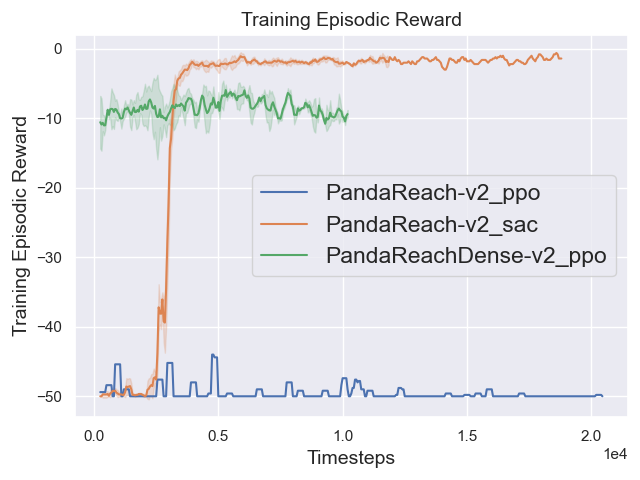
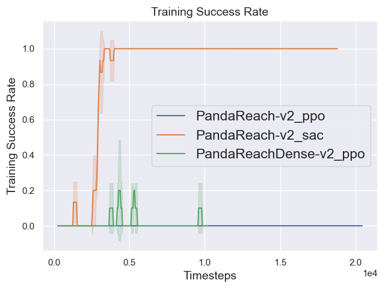
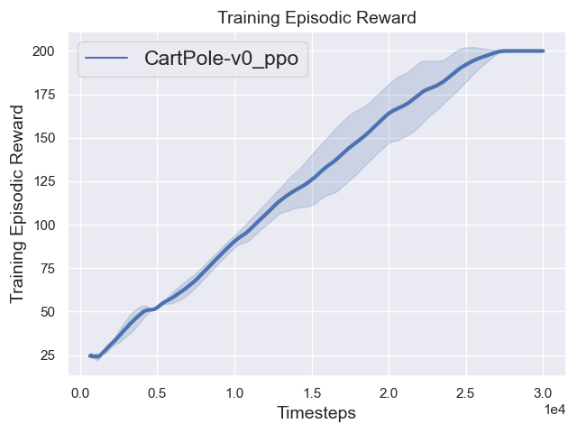
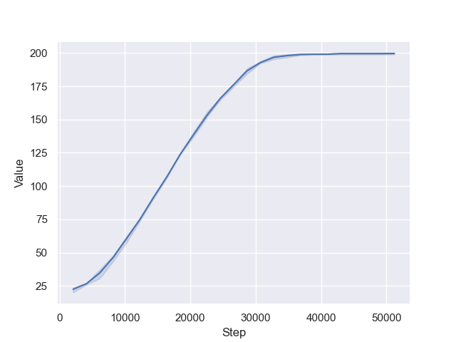
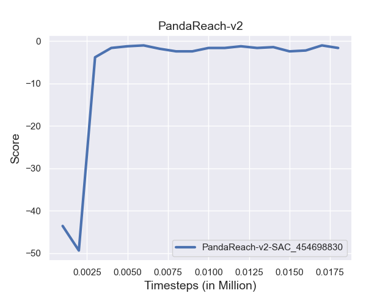

# RL_by_sb3

The scripts are used for training RL agents by [Stable-Baselines3](https://stable-baselines3.readthedocs.io/en/master/index.html).

You can use this repo to train, enjoy your agents and you can plot essential figures (learning curves etc.) for your training and evaluation.

1. `train.py`

   For example,

   ```bash
   python train.py --algo dqn --env CartPole-v0 --n-envs 4
   ```

   You can tune the `hyperparams` to run different experiments for the same env. The logger files will be saved at `--log-folder`. At the same time, `hyperparams` can be saved at `hyperparams.yml` and `args` can be saved at `args.yml`. You can also find `best model` files, `tensorboard` file, `monitor.csv`, `progress.csv`, `progress.json` and `log.txt`.

2. `enjoy.py`

   You can enjoy your agents by this script.

   ```bash
   python enjoy.py --algo dqn --env CartPole-v0
   ```

3. `monitor_plotting.py`

   You can plot single `monitor.csv` using this script. You just need to modify the `log_dir` to plot different files.

4. `plot_from_monitor_csv.py`

   Plotting learning curves from several files.

   For example,

   ```bash
   python plot_from_monitor_csv.py logdir 'data\\PandaReach'
   ```

   **Note: It is just a demo not a trained agent.**

   

   Plot success rate for some goal-based envs.

   ```bash
   python plot_from_monitor_csv.py logdir 'data\\PandaReach' -y success
   ```

   

   

5. `plot_from_progress_csv.py`

   Some envs are special (i.e. CartPole), because the episodic length is equal to the reward. The result presents by `plot_from_monitor_csv.py` is false (but `monitor_plotting.py` is correct). Using `plot_from_progress_csv.py` to tackle this problem.

   ```bash
   python plot_from_progress_csv.py logdir 'data\\CartPole-v0_ppo\\' 
   ```

   

   

   *Note*: You can also download data from `tensorboard` to achieve this. `plot_from_tensorboard_csv.py`

   

   **The data comes from another experiment.**

6. `plot_from_evalutions.py`

   You can use this script to plot figures from `evaluations.npz`

   ```bash
   python plot_from_evalutions.py -a sac --env PandaReach-v2 -f data/
   ```
   
   
   
   ```bash
   # results_table
   |Environments |  SAC   |
   |-------------|--------|
   |             |data/   |
   |PandaReach-v2|-2 +/- 0|
   ```
   
   
   
   
